In this lesson we would learn how to disassemble UEFI modules.

There are several popular frameworks for reverse engineering. In our lesson we would use [Ghidra](https://ghidra-sre.org/) since it is a pretty mature framework and a fully open-source and free option.


You can find Ghidra source code on [GitHub](https://github.com/NationalSecurityAgency/ghidra).

You can download the latest Ghidra release from its GitHub releases page - [https://github.com/NationalSecurityAgency/ghidra/releases](https://github.com/NationalSecurityAgency/ghidra/releases).

At the time of this writing (03-2024) the latest release of Ghidra is [11.0.1](https://github.com/NationalSecurityAgency/ghidra/releases/tag/Ghidra_11.0.1_build) so this is a version that I would use in the examples below.

Since Ghidra is written in Java language you need to install OpenJDK to run it. Currently the necessary version is JDK 17 64-bit. In Ubuntu you can install it via a package manager:
```
$ sudo apt install openjdk-17-jdk
```

Now we are ready to actually download and run Ghidra:
```
$ wget https://github.com/NationalSecurityAgency/ghidra/releases/download/Ghidra_11.0.1_build/ghidra_11.0.1_PUBLIC_20240130.zip
$ unzip ghidra_11.0.1_PUBLIC_20240130.zip
$ cd ghidra_11.0.1_PUBLIC
$ $ ./ghidraRun
```

On the first launch you would be prompted with the Ghidra User Agreement:

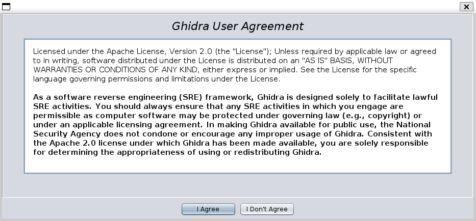

If you are agree with that you would proceed to the general project window:

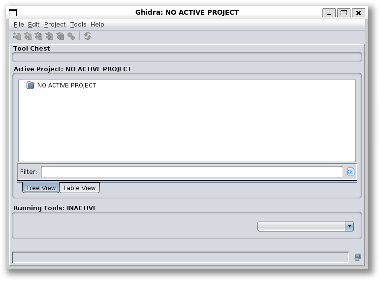

Here we need to create a project via `File->New Project` menu option. You would be prompted with a window with selection of a project type:

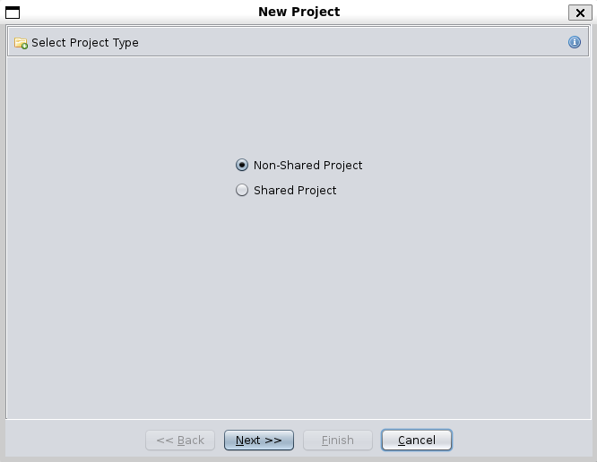

Choose default `Non-Shared Project` option and click `Next`.

In the next window set the `Project Directory` and a `Project Name`:

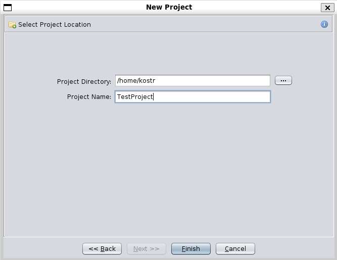

After that in the main Ghidra window you would see the created project:

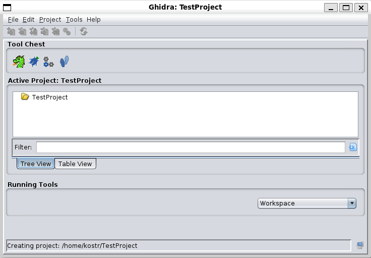

Now let's import some `*.efi` file for investigation. You can do it via the `File->Import File` menu option. Let's start with the most simple UEFI module and choose our `SimplestApp.efi` application.

In the next window Ghidra would describe it as PE format executable. Just leave everything as it is and click `OK`:

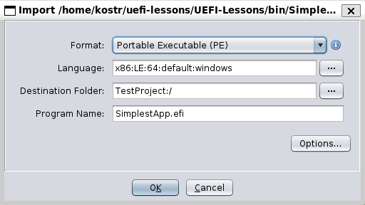

The Ghidra would print some info about our file:

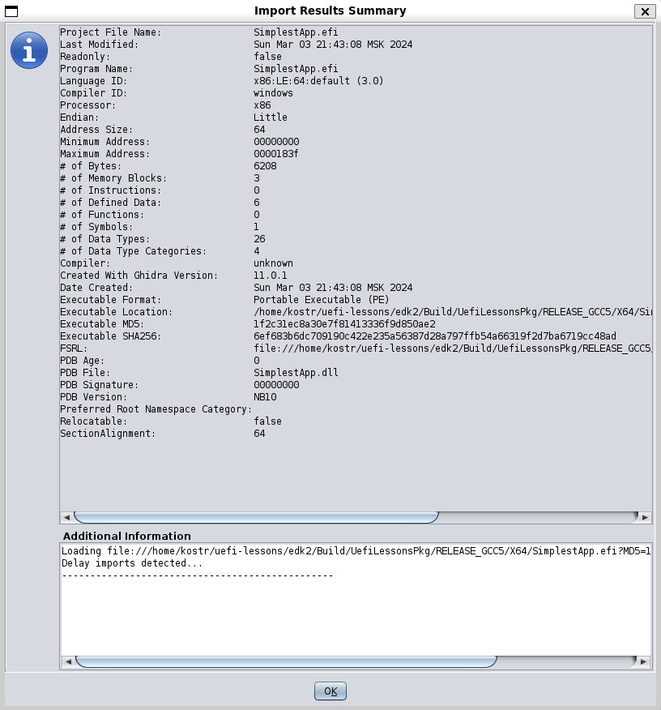

After that our application would appear under the project:

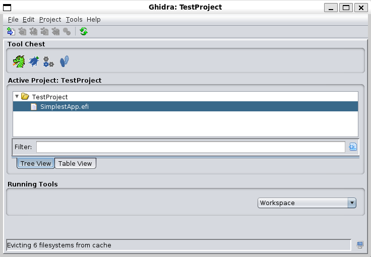

Double click on the `SimplestApp.efi` to open it in the `CodeBrowser` window.

The Ghidra would prompt if you want to analyze the file. Click `Yes`.

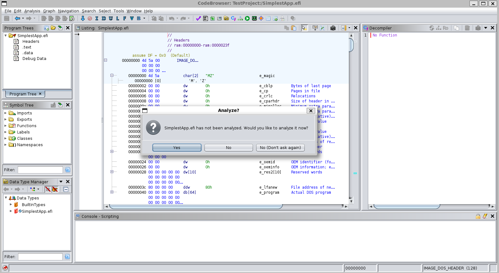

Next Ghidra would prompt you with a `Analysis Options` window, where you can select `Analyzers` that you want to launch on our file. If you want to you can click on every analyzer and read it description. Right now we don't need to change anything, so when you are ready just press the `Analyze` button:

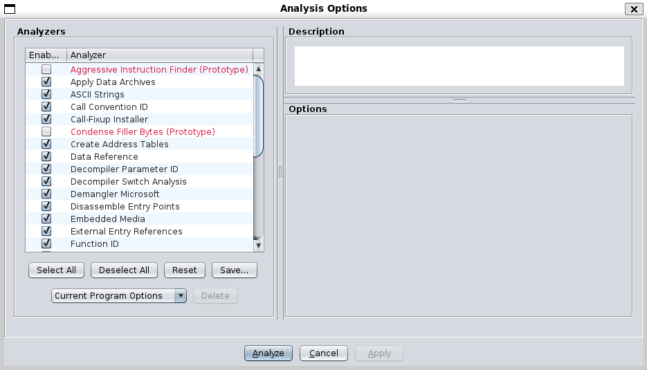

Here is the Ghidra output after running all the default analyzers:

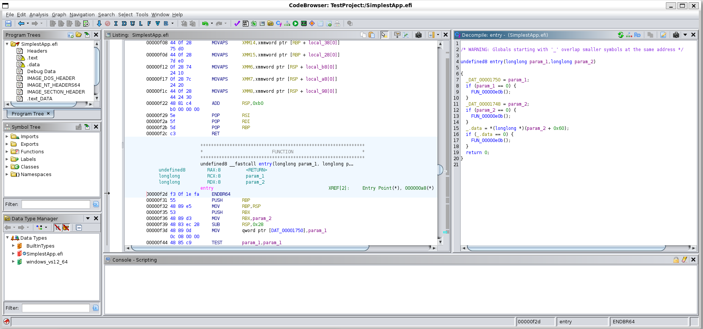

At the right window you can see that Ghidra has successfully decompiled the code our UEFI module:
```cpp
/* WARNING: Globals starting with '_' overlap smaller symbols at the same address */

undefined8 entry(longlong param_1,longlong param_2)

{
  _DAT_00001750 = param_1;
  if (param_1 == 0) {
    FUN_00000e0b();
  }
  _DAT_00001748 = param_2;
  if (param_2 == 0) {
    FUN_00000e0b();
  }
  _.data = *(longlong *)(param_2 + 0x60);
  if (_.data == 0) {
    FUN_00000e0b();
  }
  return 0;
}
```

We can work with this output, but actually we can make the output even more human-friendly.

One of the advantages of Ghidra that it can be extended with a help of plugins. Therefore before investigating the disassembler code, let's learn about `efiSeek` plugin.

# `efiSeek`

 [`efiSeek`](https://github.com/DSecurity/efiSeek) is a Ghidra plugin that helps to analyze UEFI firmware. Particularly it can:
- Find known EFI GUID’s,
- Identify protocols which are finding with `LOCATE_PROTOCOL` function,
- Identify functions used as the `NOTIFY` function
- Identify protocols installed in the module through `INSTALL_PROTOCOL_INTERFACE`,
- Identify functions used as an interrupt function (like some hardware, software or child interrupt),
- Script for loading efi modules to relevant directories upon import in Headless mode,
- Sort smm modules relying on meta information by next folders[...].

Let's clone the repo and bulld it:
```
$ git clone https://github.com/DSecurity/efiSeek.git
$ cd efiSeek/
$ chmod +x gradlew
$ GHIDRA_INSTALL_DIR=~/ghidra/ghidra_11.0.1_PUBLIC ./gradlew			# set your path to the GHIDRA_INSTALL_DIR
```

After that copy the created `*.zip` archive to the ghidra `Extensions/Ghidra/` folder:
```
$ cp dist/ghidra_11.0.1_PUBLIC_20240330_efiSeek.zip  ../ghidra_11.0.1_PUBLIC/Extensions/Ghidra/
```

Close Ghidra window and run it again.

Select menu option `File->Install Extensions`. In the opened window you should see the `efiSeek` plugin:

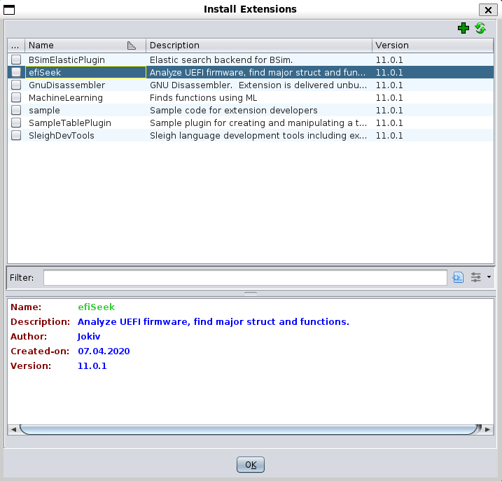

Tick this option and click `OK`:

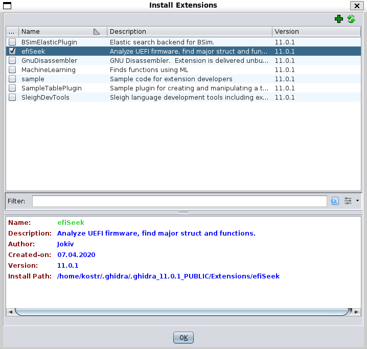

After that Ghidra would prompt that you need to restart it again:

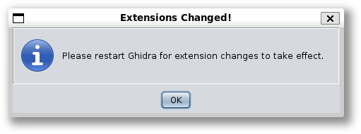

Click `OK` and restart Ghidra one more time.

Open our `SimplestApp.efi` with double click.

Now in the analyzer option you should see the `efiSeek` plugin:

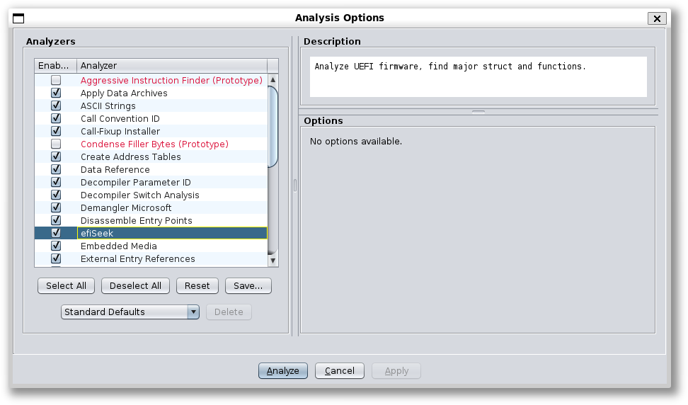

Here is the `CodeBrowser` window after the analyze operation:

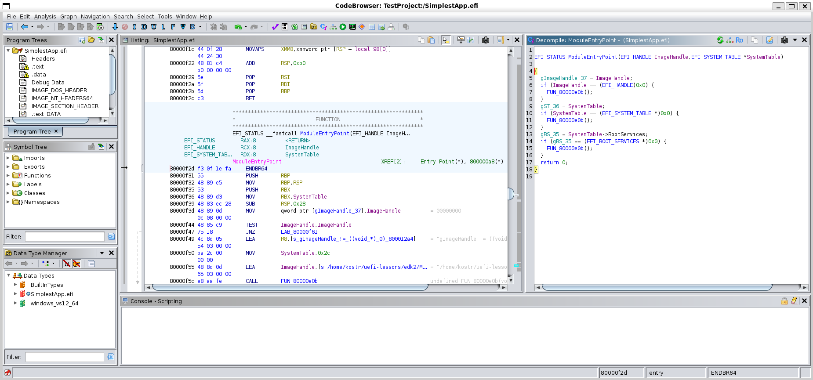

You can see that now the decompiler output now is more human-friendly:
```cpp
EFI_STATUS ModuleEntryPoint(EFI_HANDLE ImageHandle,EFI_SYSTEM_TABLE *SystemTable)

{
  gImageHandle_37 = ImageHandle;
  if (ImageHandle == (EFI_HANDLE)0x0) {
    FUN_80000e0b();
  }
  gST_36 = SystemTable;
  if (SystemTable == (EFI_SYSTEM_TABLE *)0x0) {
    FUN_80000e0b();
  }
  gBS_35 = SystemTable->BootServices;
  if (gBS_35 == (EFI_BOOT_SERVICES *)0x0) {
    FUN_80000e0b();
  }
  return 0;
}
```

# Decompiler output

Let's try to investigate the decompiler output. First let's look at the source code of our application:

```cpp
EFI_STATUS
EFIAPI
UefiMain (
  IN EFI_HANDLE        ImageHandle,
  IN EFI_SYSTEM_TABLE  *SystemTable
  )
{
  return EFI_SUCCESS;
}
```

```
[Defines]
  INF_VERSION                    = 1.25
  BASE_NAME                      = SimplestApp
  FILE_GUID                      = 4a298956-fbe0-47fb-ae3a-2d5a0a959a26
  MODULE_TYPE                    = UEFI_APPLICATION
  VERSION_STRING                 = 1.0
  ENTRY_POINT                    = UefiMain

[Sources]
  SimplestApp.c

[Packages]
  MdePkg/MdePkg.dec

[LibraryClasses]
  UefiApplicationEntryPoint
```

If you don't understand why there is more code in the decompiler is than in the initial source code, the key thing here is the `UefiApplicationEntryPoint` LibraryClass.

This module defines the `_ModuleEntryPoint` in the following way:
```cpp
EFI_STATUS
EFIAPI
_ModuleEntryPoint (
  IN EFI_HANDLE        ImageHandle,
  IN EFI_SYSTEM_TABLE  *SystemTable
  )
{
  EFI_STATUS  Status;

  if (_gUefiDriverRevision != 0) {
    //
    // Make sure that the EFI/UEFI spec revision of the platform is >= EFI/UEFI spec revision of the application.
    //
    if (SystemTable->Hdr.Revision < _gUefiDriverRevision) {
      return EFI_INCOMPATIBLE_VERSION;
    }
  }

  //
  // Call constructor for all libraries.
  //
  ProcessLibraryConstructorList (ImageHandle, SystemTable);

  //
  // Call the module's entry point
  //
  Status = ProcessModuleEntryPointList (ImageHandle, SystemTable);

  //
  // Process destructor for all libraries.
  //
  ProcessLibraryDestructorList (ImageHandle, SystemTable);

  //
  // Return the return status code from the driver entry point
  //
  return Status;
}
```

The definitions to most of these functions you can find in the generated `AutoGen.c` file (`Build/UefiLessonsPkg/RELEASE_GCC5/X64/UefiLessonsPkg/SimplestApp/SimplestApp/DEBUG/AutoGen.c`):
```cpp
RETURN_STATUS
EFIAPI
PlatformDebugLibIoPortConstructor (
  VOID
  );

EFI_STATUS
EFIAPI
UefiBootServicesTableLibConstructor (
  IN EFI_HANDLE        ImageHandle,
  IN EFI_SYSTEM_TABLE  *SystemTable
  );


VOID
EFIAPI
ProcessLibraryConstructorList (
  IN EFI_HANDLE        ImageHandle,
  IN EFI_SYSTEM_TABLE  *SystemTable
  )
{
  EFI_STATUS  Status;

  Status = PlatformDebugLibIoPortConstructor ();
  ASSERT_RETURN_ERROR (Status);

  Status = UefiBootServicesTableLibConstructor (ImageHandle, SystemTable);
  ASSERT_EFI_ERROR (Status);

}


VOID
EFIAPI
ProcessLibraryDestructorList (
  IN EFI_HANDLE        ImageHandle,
  IN EFI_SYSTEM_TABLE  *SystemTable
  )
{

}

const UINT32 _gUefiDriverRevision = 0x00000000U;


EFI_STATUS
EFIAPI
ProcessModuleEntryPointList (
  IN EFI_HANDLE        ImageHandle,
  IN EFI_SYSTEM_TABLE  *SystemTable
  )

{
  return UefiMain (ImageHandle, SystemTable);
}
```

So the empty functions and the check for the static variable `_gUefiDriverRevision` were optimized by the compiler. We also know the code from the `ProcessModuleEntryPointList` (i.e. `UefiMain`) shouldn't give us anything since the entry point of our application is basically empty. So the code that we actually see in the decompiler output is from the `ProcessLibraryConstructorList` (i.e. `UefiBootServicesTableLibConstructor`).

If you look at the [UefiApplicationEntryPoint.inf](https://github.com/tianocore/edk2/blob/master/MdePkg/Library/UefiApplicationEntryPoint/UefiApplicationEntryPoint.inf) you would see that it has the [`UefiBootServicesTableLib`](https://github.com/tianocore/edk2/blob/master/MdePkg/Library/UefiBootServicesTableLib/UefiBootServicesTableLib.inf) LibraryClass in itself. This is why it is included in the `AutoGen.c` in the first place.

Now let's look at the [UefiBootServicesTableLib source code](https://github.com/tianocore/edk2/blob/master/MdePkg/Library/UefiBootServicesTableLib/UefiBootServicesTableLib.c):
```cpp
EFI_HANDLE         gImageHandle = NULL;
EFI_SYSTEM_TABLE   *gST         = NULL;
EFI_BOOT_SERVICES  *gBS         = NULL;

/**
  The constructor function caches the pointer of Boot Services Table.

  The constructor function caches the pointer of Boot Services Table through System Table.
  It will ASSERT() if the pointer of System Table is NULL.
  It will ASSERT() if the pointer of Boot Services Table is NULL.
  It will always return EFI_SUCCESS.

  @param  ImageHandle   The firmware allocated handle for the EFI image.
  @param  SystemTable   A pointer to the EFI System Table.

  @retval EFI_SUCCESS   The constructor always returns EFI_SUCCESS.

**/

EFI_STATUS
EFIAPI
UefiBootServicesTableLibConstructor (
  IN EFI_HANDLE        ImageHandle,
  IN EFI_SYSTEM_TABLE  *SystemTable
  )
{
  //
  // Cache the Image Handle
  //
  gImageHandle = ImageHandle;
  ASSERT (gImageHandle != NULL);

  //
  // Cache pointer to the EFI System Table
  //
  gST = SystemTable;
  ASSERT (gST != NULL);

  //
  // Cache pointer to the EFI Boot Services Table
  //
  gBS = SystemTable->BootServices;
  ASSERT (gBS != NULL);

  return EFI_SUCCESS;
}
```

This is the decompiler output that we saw in Ghidra! Here it is one more time for comparision:
```cpp
EFI_STATUS ModuleEntryPoint(EFI_HANDLE ImageHandle,EFI_SYSTEM_TABLE *SystemTable)

{
  gImageHandle_37 = ImageHandle;
  if (ImageHandle == (EFI_HANDLE)0x0) {
    FUN_80000e0b();
  }
  gST_36 = SystemTable;
  if (SystemTable == (EFI_SYSTEM_TABLE *)0x0) {
    FUN_80000e0b();
  }
  gBS_35 = SystemTable->BootServices;
  if (gBS_35 == (EFI_BOOT_SERVICES *)0x0) {
    FUN_80000e0b();
  }
  return 0;
}
```

You can see that the decompiler did a good job, one code practicaly matches the one.

Off course it is not the exact match. For example the C preprocessor has substituted `EFI_SUCCESS` and `NULL` defines with 0, so this information was lost in the compilation step, and the decompiler can't do anything about it.

Also instead of the `ASSERT` define statement there are actual functions `FUN_80000e0b()`. You can double-click it in the decompiler window to check the implementation, but beware that it is not a small function.

From this example you can also see how the the compiler optimizes the empty functions or performs tail-call optimizations.

But all and all the general code flow is pretty understandable and matches the original source code.

# `SimpleDriver`

Let's try to decompile UEFI driver now. Use `File->Import File` menu option to load our `SimpleDriver` UEFI driver.

Here is its source code:
```cpp
EFI_STATUS
EFIAPI
SimpleDriverUnload (
  EFI_HANDLE ImageHandle
  )
{
  Print(L"Bye-bye from driver!\n");

  return EFI_SUCCESS;
}

EFI_STATUS
EFIAPI
SimpleDriverEntryPoint (
  IN EFI_HANDLE        ImageHandle,
  IN EFI_SYSTEM_TABLE  *SystemTable
  )
{
  Print(L"Hello from driver!\n");

  return EFI_SUCCESS;
}
```

ANd INF file:
```
[Defines]
  INF_VERSION                    = 1.25
  BASE_NAME                      = SimpleDriver
  FILE_GUID                      = 384aeb18-105d-4af1-bf17-5e349e8f4d4c
  MODULE_TYPE                    = UEFI_DRIVER
  VERSION_STRING                 = 1.0
  ENTRY_POINT                    = SimpleDriverEntryPoint
  UNLOAD_IMAGE                   = SimpleDriverUnload

[Sources]
  SimpleDriver.c

[Packages]
  MdePkg/MdePkg.dec

[LibraryClasses]
  UefiDriverEntryPoint
  UefiLib
```

And here is what you could see in the decompiler:
```cpp
EFI_STATUS ModuleEntryPoint(EFI_HANDLE ImageHandle,EFI_SYSTEM_TABLE *SystemTable)

{
  char *pcVar1;
  EFI_GUID *SystemTable_00;
  undefined8 in_R9;
  void *local_20;

  gImageHandle_136 = ImageHandle;
  if (ImageHandle == (EFI_HANDLE)0x0) {
    FUN_8000108b();
  }
  gST_139 = SystemTable;
  if (SystemTable == (EFI_SYSTEM_TABLE *)0x0) {
    FUN_8000108b();
  }
  gBS_138 = SystemTable->BootServices;
  if (gBS_138 == (EFI_BOOT_SERVICES *)0x0) {
    FUN_8000108b();
  }
  gRS_137 = SystemTable->RuntimeServices;
  if (gRS_137 == (EFI_RUNTIME_SERVICES *)0x0) {
    FUN_8000108b();
  }
  SystemTable_00 = &EFI_LOADED_IMAGE_PROTOCOL_GUID;
  pcVar1 = (char *)(*gBS_138->HandleProtocol)(ImageHandle,&EFI_LOADED_IMAGE_PROTOCOL_GUID,&local_20)
  ;
  if ((longlong)pcVar1 < 0) {
    FUN_800011c0();
    pcVar1 = s_!(((INTN)(RETURN_STATUS)(Status)_80001a92;
    SystemTable_00 = (EFI_GUID *)0x74;
    FUN_8000108b();
  }
  *(undefined **)((longlong)local_20 + 0x58) = &LAB_8000140a;
  FUN_80001259((byte *)u_Hello_from_driver!_80001cb6,(EFI_SYSTEM_TABLE *)SystemTable_00,pcVar1,in_R9
              );
  return 0;
}
```

Once again we need to start from the entry point. For the driver it is the [`UefiDriverEntryPoint`](https://github.com/tianocore/edk2/blob/master/MdePkg/Library/UefiDriverEntryPoint/UefiDriverEntryPoint.inf). Here is how it defines the `_ModuleEntryPoint`:

```cpp
EFI_STATUS
EFIAPI
_ModuleEntryPoint (
  IN EFI_HANDLE        ImageHandle,
  IN EFI_SYSTEM_TABLE  *SystemTable
  )
{
  EFI_STATUS                 Status;
  EFI_LOADED_IMAGE_PROTOCOL  *LoadedImage;

  if (_gUefiDriverRevision != 0) {
    //
    // Make sure that the EFI/UEFI spec revision of the platform is >= EFI/UEFI spec revision of the driver
    //
    if (SystemTable->Hdr.Revision < _gUefiDriverRevision) {
      return EFI_INCOMPATIBLE_VERSION;
    }
  }

  //
  // Call constructor for all libraries
  //
  ProcessLibraryConstructorList (ImageHandle, SystemTable);

  //
  //  Install unload handler...
  //
  if (_gDriverUnloadImageCount != 0) {
    Status = gBS->HandleProtocol (
                    ImageHandle,
                    &gEfiLoadedImageProtocolGuid,
                    (VOID **)&LoadedImage
                    );
    ASSERT_EFI_ERROR (Status);
    LoadedImage->Unload = _DriverUnloadHandler;
  }

  //
  // Call the driver entry point
  //
  Status = ProcessModuleEntryPointList (ImageHandle, SystemTable);

  //
  // If all of the drivers returned errors, then invoke all of the library destructors
  //
  if (EFI_ERROR (Status)) {
    ProcessLibraryDestructorList (ImageHandle, SystemTable);
  }

  //
  // Return the cummalative return status code from all of the driver entry points
  //
  return Status;
}
```

As before let's look at the `AutoGen.c` file (`Build/UefiLessonsPkg/RELEASE_GCC5/X64/UefiLessonsPkg/SimpleDriver/SimpleDriver/DEBUG/AutoGen.c`):
```cpp
RETURN_STATUS
EFIAPI
PlatformDebugLibIoPortConstructor (
  VOID
  );

EFI_STATUS
EFIAPI
UefiBootServicesTableLibConstructor (
  IN EFI_HANDLE        ImageHandle,
  IN EFI_SYSTEM_TABLE  *SystemTable
  );

EFI_STATUS
EFIAPI
UefiRuntimeServicesTableLibConstructor (
  IN EFI_HANDLE        ImageHandle,
  IN EFI_SYSTEM_TABLE  *SystemTable
  );

EFI_STATUS
EFIAPI
UefiLibConstructor (
  IN EFI_HANDLE        ImageHandle,
  IN EFI_SYSTEM_TABLE  *SystemTable
  );


VOID
EFIAPI
ProcessLibraryConstructorList (
  IN EFI_HANDLE        ImageHandle,
  IN EFI_SYSTEM_TABLE  *SystemTable
  )
{
  EFI_STATUS  Status;

  Status = PlatformDebugLibIoPortConstructor ();
  ASSERT_RETURN_ERROR (Status);

  Status = UefiBootServicesTableLibConstructor (ImageHandle, SystemTable);
  ASSERT_EFI_ERROR (Status);

  Status = UefiRuntimeServicesTableLibConstructor (ImageHandle, SystemTable);
  ASSERT_EFI_ERROR (Status);

  Status = UefiLibConstructor (ImageHandle, SystemTable);
  ASSERT_EFI_ERROR (Status);

}


VOID
EFIAPI
ProcessLibraryDestructorList (
  IN EFI_HANDLE        ImageHandle,
  IN EFI_SYSTEM_TABLE  *SystemTable
  )
{

}

const UINT32 _gUefiDriverRevision = 0x00000000U;
const UINT32 _gDxeRevision = 0x00000000U;


EFI_STATUS
EFIAPI
ProcessModuleEntryPointList (
  IN EFI_HANDLE        ImageHandle,
  IN EFI_SYSTEM_TABLE  *SystemTable
  )

{
  return SimpleDriverEntryPoint (ImageHandle, SystemTable);
}

...

GLOBAL_REMOVE_IF_UNREFERENCED const UINT8 _gDriverUnloadImageCount = 1U;


EFI_STATUS
EFIAPI
ProcessModuleUnloadList (
  IN EFI_HANDLE        ImageHandle
  )
{
  return SimpleDriverUnload (ImageHandle);
}
```

Once again the `if (_gUefiDriverRevision != 0)` check is optimized since its value is known at the compilation step.

As we already know the `ProcessLibraryConstructorList(...)` function inserts all the library constructor codes. In our case it is the code for the `UefiBootServicesTableLib` library code that is used in the [`UefiDriverEntryPoint.inf` itself](https://github.com/tianocore/edk2/blob/master/MdePkg/Library/UefiDriverEntryPoint/UefiDriverEntryPoint.inf),  the `UefiRuntimeServicesTableLib` library code that is used by the [`UefiLib`](https://github.com/tianocore/edk2/blob/master/MdePkg/Library/UefiLib/UefiLib.inf) that we've included to our driver to be able to use the `Print` function, and the `UefiLib` library constructor itself. But since the last one is basically an empty function ([https://github.com/tianocore/edk2/blob/master/MdePkg/Library/UefiLib/UefiLib.c](https://github.com/tianocore/edk2/blob/master/MdePkg/Library/UefiLib/UefiLib.c)):
```
EFI_STATUS
EFIAPI
UefiLibConstructor (
  IN EFI_HANDLE        ImageHandle,
  IN EFI_SYSTEM_TABLE  *SystemTable
  )
{
  return EFI_SUCCESS;
}
```
it is optimized by the compiler.

Therefore the library construction code gives us the following decompiler output:
```cpp
  gImageHandle_136 = ImageHandle;
  if (ImageHandle == (EFI_HANDLE)0x0) {
    FUN_8000108b();
  }
  gST_139 = SystemTable;
  if (SystemTable == (EFI_SYSTEM_TABLE *)0x0) {
    FUN_8000108b();
  }
  gBS_138 = SystemTable->BootServices;
  if (gBS_138 == (EFI_BOOT_SERVICES *)0x0) {
    FUN_8000108b();
  }
  gRS_137 = SystemTable->RuntimeServices;
  if (gRS_137 == (EFI_RUNTIME_SERVICES *)0x0) {
    FUN_8000108b();
  }
```

After the `ProcessLibraryConstructorList(...)` there is a `HandleProtocol` call:
```cpp
if (_gDriverUnloadImageCount != 0) {
  Status = gBS->HandleProtocol (
                  ImageHandle,
                  &gEfiLoadedImageProtocolGuid,
                  (VOID **)&LoadedImage
                  );
  ASSERT_EFI_ERROR (Status);
  LoadedImage->Unload = _DriverUnloadHandler;
}
```

Once again the check for global variable (`_gDriverUnloadImageCount` in this case) is optimized by the compiler:
```cpp
  char *pcVar1;
  EFI_GUID *SystemTable_00;
  void *local_20;
  ...

  SystemTable_00 = &EFI_LOADED_IMAGE_PROTOCOL_GUID;
  pcVar1 = (char *)(*gBS_138->HandleProtocol)(ImageHandle,&EFI_LOADED_IMAGE_PROTOCOL_GUID,&local_20)
  ;
  if ((longlong)pcVar1 < 0) {
    FUN_800011c0();
    pcVar1 = s_!(((INTN)(RETURN_STATUS)(Status)_80001a92;
    SystemTable_00 = (EFI_GUID *)0x74;
    FUN_8000108b();
  }
  *(undefined **)((longlong)local_20 + 0x58) = &LAB_8000140a
```

The second parameter of the `HandleProtocol` function probably should be the `SystemTable_00` instead of the `EFI_LOADED_IMAGE_PROTOCOL_GUID`, this is probably a `efiSeek` plugin mistake. Everything under the `((longlong)pcVar1 < 0)` is the `ASSERT_EFI_ERROR (Status)` check, so don't pay very much attention to it. The `local_20` variable is our `EFI_LOADED_IMAGE_PROTOCOL  *LoadedImage` variable, and `local_20 + 0x58` is just an address for the `LoadedImage->Unload` function. If you want to verify it, just check the definition for the `EFI_LOADED_IMAGE_PROTOCOL` and calculate the offset to its `Unload` field.
```cpp
typedef struct {
   UINT32                        Revision;
   EFI_HANDLE                    ParentHandle;
   EFI_System_Table              *SystemTable;

   // Source location of the image
   EFI_HANDLE                    DeviceHandle;
   EFI_DEVICE_PATH_PROTOCOL      *FilePath;
   VOID                          *Reserved;

   // Image’s load options
   UINT32                        LoadOptionsSize;
   VOID                          *LoadOptions;

   // Location where image was loaded
   VOID                          *ImageBase;
   UINT64                        ImageSize;
   EFI_MEMORY_TYPE               ImageCodeType;
   EFI_MEMORY_TYPE               ImageDataType;
   EFI_IMAGE_UNLOAD              Unload;
} EFI_LOADED_IMAGE_PROTOCOL;
```

Therefore the `LAB_8000140a` should be our `SimpleDriverUnload` function. You can double-click to the `LAB_8000140a` to jump to its definition and actually see the content of our `SimpleDriverUnload` function:
```cpp
undefined8
UndefinedFunction_8000140a
          (undefined8 param_1,EFI_SYSTEM_TABLE *param_2,undefined8 param_3,undefined8 param_4)

{
  FUN_80001259((byte *)u_Bye-bye_from_driver!_80001b14,param_2,param_3,param_4);
  return 0;
}
```
It is pretty obvious that the `FUN_80001259` is the `Print` function.

Finally the last string of the decompiler output is from the source code:
```
  //
  // Call the driver entry point
  //
  Status = ProcessModuleEntryPointList (ImageHandle, SystemTable);

  ...

  return Status;
```

Here you can see the the compiler simply has inserted the `Print` statement from the entry point of our driver:
```cpp
  FUN_80001259((byte *)u_Hello_from_driver!_80001cb6,(EFI_SYSTEM_TABLE *)SystemTable_00,pcVar1,in_R9);
  return 0;
```

That is all. We've covered all the decompiler output. Once again you could see how heavily tail-call/inline optimizations are used by the compiler and how it optimizes all the empty functions.

# SimpleShellApp

Let's try to decompile some application with a Shell entry point. As a simple example we can use our `SimpleShellApp.efi` application. It has the following `*.c` file:
```cpp
INTN EFIAPI ShellAppMain(IN UINTN Argc, IN CHAR16 **Argv)
{
  gST->ConOut->OutputString(gST->ConOut, L"Hello again!\n");
  Print(L"Bye!\n");

  for (UINTN i=Argc; i>0; i--) {
    Print(L"Arg[%d]=%s\n", Argc-i, Argv[Argc-i]);
  }
  return 0;
}
```

And a following INF file:
```
[Defines]
  INF_VERSION                    = 1.25
  BASE_NAME                      = SimpleShellApp
  FILE_GUID                      = 2afd1202-545e-4f8d-b8fb-bc179e84ddc8
  MODULE_TYPE                    = UEFI_APPLICATION
  VERSION_STRING                 = 1.0
  ENTRY_POINT                    = ShellCEntryLib

[Sources]
  SimpleShellApp.c

[Packages]
  MdePkg/MdePkg.dec

[LibraryClasses]
  UefiLib
  ShellCEntryLib
```

The decompiler output for such module looks like this:
```cpp
EFI_STATUS ModuleEntryPoint(EFI_HANDLE ImageHandle,EFI_SYSTEM_TABLE *SystemTable)

{
  EFI_STATUS EVar1;
  EFI_SYSTEM_TABLE *ImageHandle0;
  EFI_SYSTEM_TABLE *SystemTable93;
  EFI_SYSTEM_TABLE ***Interface;
  EFI_HANDLE pvVar2;
  EFI_SYSTEM_TABLE **local_28;
  EFI_SYSTEM_TABLE **local_20;

  gImageHandle_152 = ImageHandle;
  if (ImageHandle == (EFI_HANDLE)0x0) {
    FUN_8000108b();
  }
  gST_154 = SystemTable;
  if (SystemTable == (EFI_SYSTEM_TABLE *)0x0) {
    FUN_8000108b();
  }
  gBS_151 = SystemTable->BootServices;
  if (gBS_151 == (EFI_BOOT_SERVICES *)0x0) {
    FUN_8000108b();
  }
  gRS_153 = SystemTable->RuntimeServices;
  if (gRS_153 == (EFI_RUNTIME_SERVICES *)0x0) {
    FUN_8000108b();
  }
  Interface = &local_28;
  local_28 = (EFI_SYSTEM_TABLE **)0x0;
  local_20 = (EFI_SYSTEM_TABLE **)0x0;
  pvVar2 = ImageHandle;
  EVar1 = (*SystemTable->BootServices->OpenProtocol)
                    (ImageHandle,&EFI_SHELL_PARAMETERS_PROTOCOL_GUID,Interface,ImageHandle,
                     (EFI_HANDLE)0x0,2);
  if ((longlong)EVar1 < 0) {
    Interface = &local_20;
    EVar1 = (*SystemTable->BootServices->OpenProtocol)
                      (ImageHandle,&SHELL_INTERFACE_PROTOCOL_GUID,Interface,ImageHandle,
                       (EFI_HANDLE)0x0,2);
    if ((longlong)EVar1 < 0) {
      FUN_8000108b();
      return 0xffffffffffffffff;
    }
    SystemTable93 = local_20[2];
    ImageHandle0 = local_20[3];
  }
  else {
    ImageHandle0 = local_28[1];
    SystemTable93 = *local_28;
    ImageHandle = pvVar2;
  }
  EVar1 = FUN_8000140a(ImageHandle0,SystemTable93,Interface,ImageHandle);
  return EVar1;
}
```

Once again let's start from the entry point. In this case it is `ShellCEntryLib`. But if you'll look at its INF file you will see that it is just a wrapper around the `UefiApplicationEntryPoint`  [(`https://github.com/tianocore/edk2/blob/master/ShellPkg/Library/UefiShellCEntryLib/UefiShellCEntryLib.inf`)](https://github.com/tianocore/edk2/blob/master/ShellPkg/Library/UefiShellCEntryLib/UefiShellCEntryLib.inf).

We've already investigated the `UefiApplicationEntryPoint` entry point and know that it calls all the library constructors at the beginning. So this decompiler output is produced from that part:
```cpp
gImageHandle_152 = ImageHandle;
if (ImageHandle == (EFI_HANDLE)0x0) {
  FUN_8000108b();
}
gST_154 = SystemTable;
if (SystemTable == (EFI_SYSTEM_TABLE *)0x0) {
  FUN_8000108b();
}
gBS_151 = SystemTable->BootServices;
if (gBS_151 == (EFI_BOOT_SERVICES *)0x0) {
  FUN_8000108b();
}
gRS_153 = SystemTable->RuntimeServices;
if (gRS_153 == (EFI_RUNTIME_SERVICES *)0x0) {
  FUN_8000108b();
}
```
Nothing new here for us, so let's move next. In case you don't remember after the library constructors the `UefiApplicationEntryPoint` calls the `ProcessModuleEntryPointList` function.

And if you'll look at the `Build/UefiLessonsPkg/RELEASE_GCC5/X64/UefiLessonsPkg/SimpleShellApp/SimpleShellApp/DEBUG/AutoGen.c` you will see how this call connects to the `ShellCEntryLib` entry point:
```cpp
EFI_STATUS
EFIAPI
ProcessModuleEntryPointList (
  IN EFI_HANDLE        ImageHandle,
  IN EFI_SYSTEM_TABLE  *SystemTable
  )

{
  return ShellCEntryLib (ImageHandle, SystemTable);
}
```

The implementation of the `ShellCEntryLib` is provided in the [`ShellPkg/Library/UefiShellCEntryLib/UefiShellCEntryLib.c`](https://github.com/tianocore/edk2/blob/master/ShellPkg/Library/UefiShellCEntryLib/UefiShellCEntryLib.c):
```cpp
EFI_STATUS
EFIAPI
ShellCEntryLib (
  IN EFI_HANDLE        ImageHandle,
  IN EFI_SYSTEM_TABLE  *SystemTable
  )
{
  INTN                           ReturnFromMain;
  EFI_SHELL_PARAMETERS_PROTOCOL  *EfiShellParametersProtocol;
  EFI_SHELL_INTERFACE            *EfiShellInterface;
  EFI_STATUS                     Status;

  ReturnFromMain             = -1;
  EfiShellParametersProtocol = NULL;
  EfiShellInterface          = NULL;

  Status = SystemTable->BootServices->OpenProtocol (
                                        ImageHandle,
                                        &gEfiShellParametersProtocolGuid,
                                        (VOID **)&EfiShellParametersProtocol,
                                        ImageHandle,
                                        NULL,
                                        EFI_OPEN_PROTOCOL_GET_PROTOCOL
                                        );
  if (!EFI_ERROR (Status)) {
    //
    // use shell 2.0 interface
    //
    ReturnFromMain = ShellAppMain (
                       EfiShellParametersProtocol->Argc,
                       EfiShellParametersProtocol->Argv
                       );
  } else {
    //
    // try to get shell 1.0 interface instead.
    //
    Status = SystemTable->BootServices->OpenProtocol (
                                          ImageHandle,
                                          &gEfiShellInterfaceGuid,
                                          (VOID **)&EfiShellInterface,
                                          ImageHandle,
                                          NULL,
                                          EFI_OPEN_PROTOCOL_GET_PROTOCOL
                                          );
    if (!EFI_ERROR (Status)) {
      //
      // use shell 1.0 interface
      //
      ReturnFromMain = ShellAppMain (
                         EfiShellInterface->Argc,
                         EfiShellInterface->Argv
                         );
    } else {
      ASSERT (FALSE);
    }
  }

  return ReturnFromMain;
}
```

This looks similar to the decompiler output:
```cpp
EFI_STATUS EVar1;
EFI_SYSTEM_TABLE *ImageHandle0;
EFI_SYSTEM_TABLE *SystemTable93;
EFI_SYSTEM_TABLE ***Interface;
EFI_HANDLE pvVar2;
EFI_SYSTEM_TABLE **local_28;
EFI_SYSTEM_TABLE **local_20;

...

Interface = &local_28;
local_28 = (EFI_SYSTEM_TABLE **)0x0;
local_20 = (EFI_SYSTEM_TABLE **)0x0;
pvVar2 = ImageHandle;
EVar1 = (*SystemTable->BootServices->OpenProtocol)
                  (ImageHandle,&EFI_SHELL_PARAMETERS_PROTOCOL_GUID,Interface,ImageHandle,
                   (EFI_HANDLE)0x0,2);
if ((longlong)EVar1 < 0) {
  Interface = &local_20;
  EVar1 = (*SystemTable->BootServices->OpenProtocol)
                    (ImageHandle,&SHELL_INTERFACE_PROTOCOL_GUID,Interface,ImageHandle,
                     (EFI_HANDLE)0x0,2);
  if ((longlong)EVar1 < 0) {
    FUN_8000108b();
    return 0xffffffffffffffff;
  }
  SystemTable93 = local_20[2];
  ImageHandle0 = local_20[3];
}
else {
  ImageHandle0 = local_28[1];
  SystemTable93 = *local_28;
  ImageHandle = pvVar2;
}
EVar1 = FUN_8000140a(ImageHandle0,SystemTable93,Interface,ImageHandle);
return EVar1;
```

If you'll compare this output with the original source code you can identify some decompiler flaws.

For example it is pretty obvious that `local_28` should be the type of `EFI_SHELL_PARAMETERS_PROTOCOL*` and `local_20` should be the type of `EFI_SHELL_INTERFACE*`. But unfortunately Ghidra's `efiSeek` plugin is not aware of such types. Moreover for some reason it tends to insert `EFI_SYSTEM_TABLE*` where it can instead of something like `VOID*`. So don't get confused with the `EFI_SYSTEM_TABLE's` everywhere. The same is for the `ImageHandle` and `SystemTable`. The decompiler can give such prefixes to the variables totally unrelated to the `ImageHandle` or `SystemTable`. For example the `ImageHandle0` and `SystemTable93` in the output is just `UINTN Argc`/`CHAR16 **Argv` arguments for our console application. So sometimes it can even be beneficial to turn off the `efiSeek` plugin and work with just the native types:
```cpp
undefined8 entry(longlong param_1,longlong param_2)

{
  longlong lVar1;
  longlong lVar2;
  undefined8 uVar3;
  ulonglong *puVar4;
  longlong **pplVar5;
  longlong *local_28;
  longlong *local_20;

  <...>

  pplVar5 = &local_28;
  local_28 = (longlong *)0x0;
  local_20 = (longlong *)0x0;
  lVar2 = param_1;
  lVar1 = (**(code **)(*(longlong *)(param_2 + 0x60) + 0x118))
                    (param_1,&DAT_00002150,pplVar5,param_1,0,2);
  if (lVar1 < 0) {
    pplVar5 = &local_20;
    lVar2 = (**(code **)(*(longlong *)(param_2 + 0x60) + 0x118))(param_1,&.data,pplVar5,param_1,0,2)
    ;
    if (lVar2 < 0) {
      FUN_0000108b();
      return 0xffffffffffffffff;
    }
    lVar1 = local_20[2];
    puVar4 = (ulonglong *)local_20[3];
  }
  else {
    puVar4 = (ulonglong *)local_28[1];
    lVar1 = *local_28;
    param_1 = lVar2;
  }
  uVar3 = FUN_0000140a(puVar4,lVar1,pplVar5,param_1);
  return uVar3;
}
```

Another strange thing that you can notice is an array access like `local_20[3]`. To understand it don't think of `local_20` as a pointer to a protocol, but just a pointer to memory (aka `VOID*`). And replace array access with an offset, i.e.:
```
local_20[3]  =  (void*)local_20 + sizeof(void*)*3
```

To understand the origin of the actual offsets you need to look at the definitions of the [`EFI_SHELL_PARAMETERS_PROTOCOL`](https://github.com/tianocore/edk2/blob/master/MdePkg/Include/Protocol/ShellParameters.h) and [`EFI_SHELL_INTERFACE`(https://github.com/tianocore/edk2/blob/master/ShellPkg/Include/Protocol/EfiShellInterface.h):

```cpp
typedef struct _EFI_SHELL_PARAMETERS_PROTOCOL {
  CHAR16               **Argv;
  UINTN                Argc;
  SHELL_FILE_HANDLE    StdIn;
  SHELL_FILE_HANDLE    StdOut;
  SHELL_FILE_HANDLE    StdErr;
} EFI_SHELL_PARAMETERS_PROTOCOL;
```
```cpp
typedef struct {
  EFI_HANDLE                   ImageHandle;
  EFI_LOADED_IMAGE_PROTOCOL    *Info;
  CHAR16                       **Argv;
  UINTN                        Argc;
  CHAR16                       **RedirArgv;
  UINTN                        RedirArgc;
  EFI_FILE_PROTOCOL            *StdIn;
  EFI_FILE_PROTOCOL            *StdOut;
  EFI_FILE_PROTOCOL            *StdErr;
  EFI_SHELL_ARG_INFO           *ArgInfo;
  BOOLEAN                      EchoOn;
} EFI_SHELL_INTERFACE;
```
If you'll look closely to these definition you'll see that these offsets is just a way to get to the `**Argv`/`Argc` fields.

Finally let's click to the `FUN_8000140a` at the end of the decompiler output to jump to the code that actually looks like our program:
```cpp
undefined8
FUN_8000140a(EFI_HANDLE ImageHandle0,EFI_SYSTEM_TABLE *SystemTable93,undefined8 param_3,
            undefined8 param_4)

{
  wchar_t *SystemTable;
  EFI_SYSTEM_TABLE *SystemTable_00;

  SystemTable = u_Hello_again!_80001ba4;
  (*gST_154->ConOut->OutputString)(gST_154->ConOut,(CHAR16 *)u_Hello_again!_80001ba4);
  FUN_80001259((byte *)u_Bye!_80001bc0,(EFI_SYSTEM_TABLE *)SystemTable,param_3,param_4);
  for (SystemTable_00 = (EFI_SYSTEM_TABLE *)0x0; (EFI_SYSTEM_TABLE *)ImageHandle0 != SystemTable_00;
      SystemTable_00 = (EFI_SYSTEM_TABLE *)((longlong)&(SystemTable_00->Hdr).Signature + 1)) {
    FUN_80001259((byte *)u_Arg[%d]=%s_80001bcc,SystemTable_00,
                 (&(SystemTable93->Hdr).Signature)[(longlong)SystemTable_00],param_4);
  }
  return 0;
}
```

Don't get shocked by the `for` condition statement:
```cpp
for (SystemTable_00 = (EFI_SYSTEM_TABLE *)0x0; (EFI_SYSTEM_TABLE *)ImageHandle0 != SystemTable_00; SystemTable_00 = (EFI_SYSTEM_TABLE *)((longlong)&(SystemTable_00->Hdr).Signature + 1))
```
This is once again have happend because the decompiler incorrectly guessed the `EFI_SYSTEM_TABLE` type.

If you'll look at the same statement without the `efiSeek` analyzer it would make much more sense:
```cpp
for (puVar2 = (ulonglong *)0x0; param_1 != puVar2; puVar2 = (ulonglong *)((longlong)puVar2 + 1))
```

I hope this simple example gave you some idea about the decompiler flaws and possible complications that you can encounter on your reverse engeneering journey.

# Alternative tools

The most popular alternative framework for the reverse engeneering would probably be the [IDA Pro](https://hex-rays.com/ida-pro/). It also has some plugins that help to investigate UEFI modules. For example [efiXplorer](https://github.com/binarly-io/efiXplorer). The main disadvantage of the IDA Pro is that it is not free. That is why we've preferred Ghidra in our lessons. But if you are into reverse engeneering, you should probably check it out as well.
